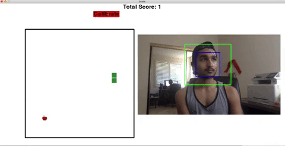

# SnakeCVML

## System
* Python 3

## Imports
* Pygame - Runs the GUI and the snake game
* CV2 - Captures the webcam footage
* numpy - Works with vectors which are calculated from the webcam footage
* dlib - Takes the webcam footage and finds landmarks on the face
    - For Windows dlib path dependencies must be added to environment must be added to environment variables when first installing on system.

## Running the Program
First, run Game/Main.py. From there, you have two options:
* Run Player, which lets you control the snake traditionally with arrow keys (or WASD)
* Run CV Game, which lets you control the snake with head movement using computer vision.
    - After running CV Game, you will see a Calibrate button which you can click at any time to set a new center.
    - Moving outside this center calibrated box in a given direction will change the snake direction.

At the end of each snake game, the score of that round will be printed in the terminal. End the program at any time by closing the window or terminating the program from terminal.

## References
* We used AKSHAYUBHAT's facial landmarks TensorFace repo to access a 2D facial landmarks file. We used this file to track facial landmark points in each frame, used in our later calculations.
    - Found here: https://github.com/AKSHAYUBHAT/TensorFace
* We found 3D model reference points on Satya Malik's LearnOpenCV's article on the subject
    - Found here: https://www.learnopencv.com/head-pose-estimation-using-opencv-and-dlib/#code

# Computer Vision Demo

 
